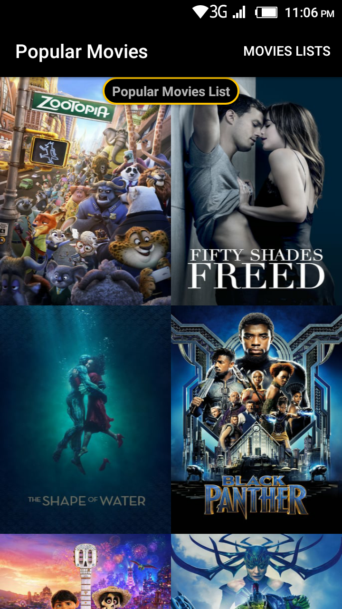
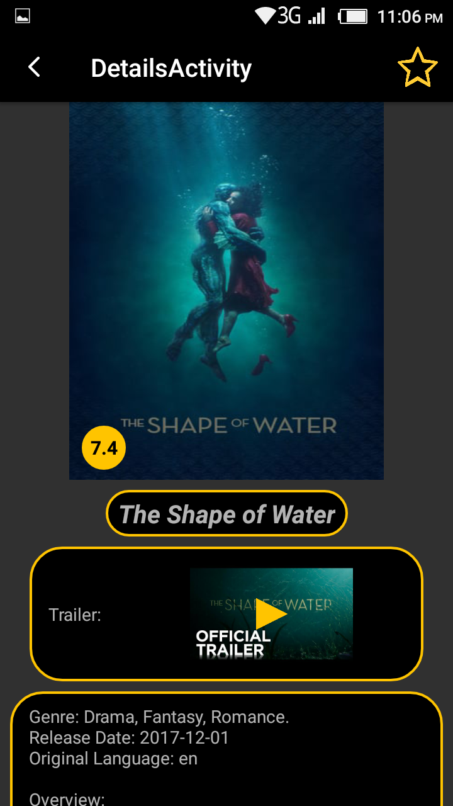
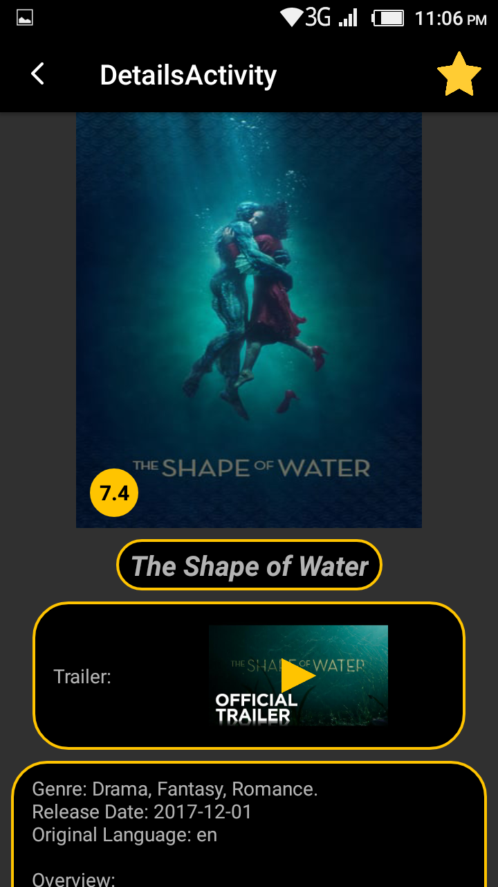
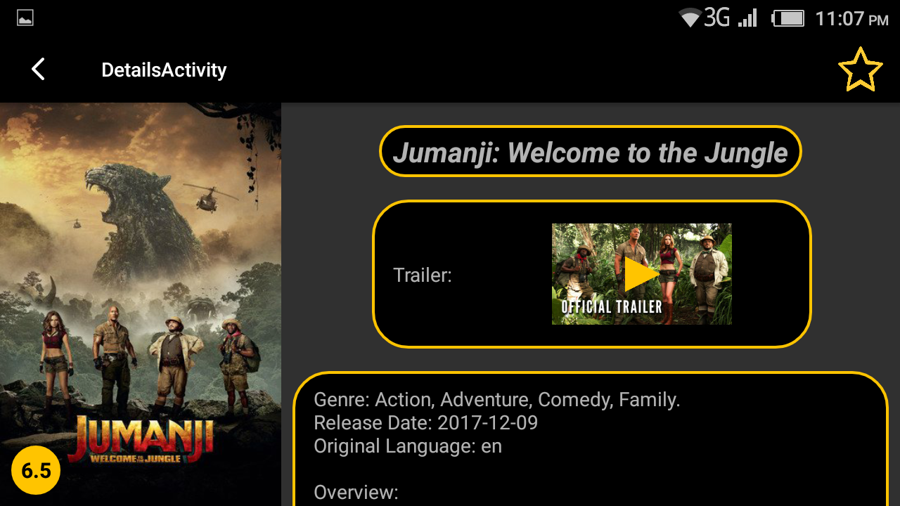
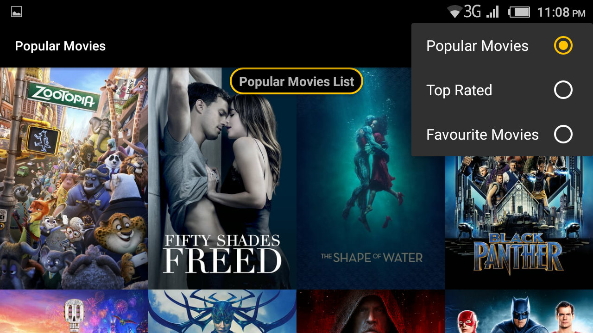

# PopularMovies
PopularMovies (Udacity project, Stage 2) is a project requested by Udacity during the Android nanodegree, and this is the first stage.

## What the app do:
1. Upon launch, present the user with an grid arrangement of movie posters.
2. Allow your user to change sort order via a setting:
   - The sort order can be by most popular, or by top rated
3. Allow the user to tap on a movie poster and transition to a details screen with additional information such as:
   - Original title
   - Movie poster
   - Release date
   - A plot synopsis
3. Allow users to view and play trailers ( either in the youtube app or a web browser).
5. Allow users to read reviews of a selected movie.
6. Allow users to mark a movie as a favorite in the details view by tapping a button(star). This is for a local movies collection that you will maintain and does not require an API request*.
7. You’ll modify the existing sorting criteria for the main view to include an additional pivot to show their favorites collection.
###### Important note:
The App won't work as it doesn't contain the DB API KEY, you can request your own key through https://www.themoviedb.org/ .

## App screenshots:
    

  

